# Unity Advanced Saving System
I needed a way to save and loading data efficiently in unity, so I decided to put in some time to create this saving system, and it turned out great! Let me show you how it works.

## How it works

- [Creating an ``ISaveable``](#creating-an-isaveable)
- [Registering our ``ISaveable``s](#registering-our-isaveables)
- [Configuring a save slot](#configuring-a-save-slot)
- [Saving and loading the game](#saving-and-loading-the-game)
- [PlayerPrefs like style of saving](#playerprefs-like-style-of-saving)
- [Editor Utilities](#editor-utilities)

### Creating an ``ISaveable``

With this plugin, you can save data from any class, as long as they implement the ``ISaveable`` interface.
We'll start with a simple unity monobehavior.
```c#
public class ExamplePlayerClass : MonoBehaviour
{
    public int health;
    public float speed;
}
```

The ``ISaveable`` interface looks like this, and requires you to implement two functions
<p align="center">
  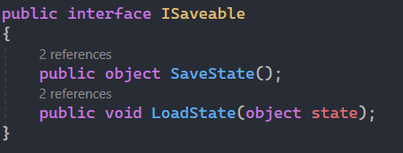
</p>
We will add the interface to our class, and implement the two functions.

```c#
public class ExamplePlayerClass : MonoBehaviour, ISaveable
{
    public int health;
    public float speed;
    
    // This function will be called when we save the game
    public object SaveState()
    {
        return null;
    }
  
    // This function will be called when we load the game
    // This functions will return the data we stored from this instance of our ExamplePlayerClass
    public void LoadState(object state)
    {
        return;
    }
}
```

For now these functions are empty, and we have no data to save.
To fix that we need to create a struct that houses the data that we want to save, and load.
This struct has to be set to ``Serializable``, otherwise, the system won't be able to save it.
Let's create the data struct, and fill in the functions!

```c#
public class ExamplePlayerClass : MonoBehaviour, ISaveable
{
    [Serializable]
    public struct Data
    {
        public int _health;
        public float _speed;
    }
  
    public int health;
    public float speed;
    
    // This function will be called when we save the game
    public object SaveState()
    {
        // Create a new Data
        var data = new Data();
        // Fill it up with the current state of our class
        data._health = health;
        data._speed = speed;
    
        // We return the object to be saved
        return data;
    }

    // This function will be called when we load the game
    // This functions will return the data we stored from this instance of our ExamplePlayerClass
    public void LoadState(object state)
    {
        // Get the data, by explicitly casting it to our Data struct
        var data = (Data) state;
        // Get the saved data
        health = data._health;
        speed = data._speed;
    }
}
```
That's all the coding you need to do.

Now for this to actually save and load, we need to do two things.

1. Register our ``ISaveable`` so it can be saved and loaded.
2. Configure our save slot (yes, this plugin handles save slots for you)

### Registering our ``ISaveable``s

Doing this is simple enough. First you add the ``Saveable`` component to yours gameobject in unity.

<p align="center">
  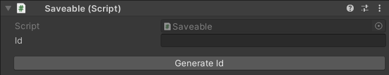
</p>

After that, hit the *Generate Id* button. This will generate a unique id for your saveable.
The id is used as a key to save and load the data from, and to the correct classes, so make sure you press that button once, when you add the ``Saveable`` component, and not press it again.

I pressed the button, and now it generated the id!

<p align="center">
  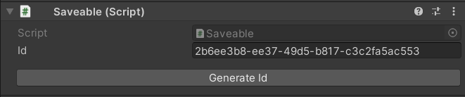
</p>

Now all you need to do, is add our ``ExamplePlayerClass`` that we created, as a component to a gameobject that has the ``Saveable`` component attached to it.
This will even work if the ``ExamplePlayerClass`` is a child of the ``Saveable component``.


<p align="center">
  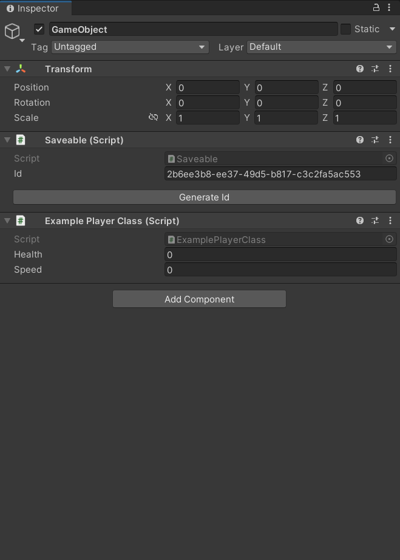
</p>

And you're done! Our ``ExamplePlayerClass`` will automatically be registered, saved and loaded!

### Configuring a save slot

We need to create a save slot to be able to save and load our data.
This is done by one function:

```c#
SaveManager.CreateSaveSlot("save_1");
```
This will create a new save slot called "save_1".

Let's a create a class that manages our save slots.
```c#
public class ExampleSaveSlotManager : MonoBehavior
{
    private void Start()
    {
        // On Start we check it we alreay have the save slot "save_1"
        // If not we create the save slot
        if (!SaveManager.SaveSlotExists("save_1"))
        {
            SaveManager.CreateSaveSlot("save_1");
        }
        /* And set it to active
        * This function takes 3 arguments:
        * First is the name of the slot
        * Second is if the system should save the data of the previously active slot, here we don't want that so we set it to false
        * And the third is if the system should load data from the new slot, we want that so we set it to true
        */
        SaveManager.SetActiveSaveSlot("save_1", false, true);
    }
}
```

That will run at the start of the game, so we should have a new slot called ``slot_1`` that gets activated at the start of the game.

Now when it comes to slots, there's more you can do, here are the functions available:

<p align="center">
  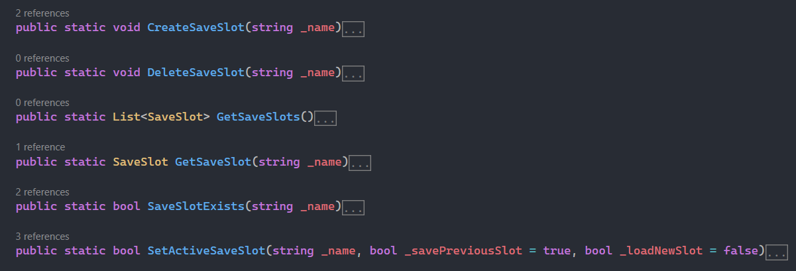
</p>

The save slot also stores some information about the playthrough. This is what the ``SaveSlot`` struct looks like:

<p align="center">
  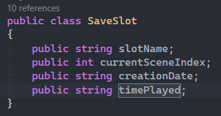
</p>

You can access your save slots, and display their information using the function above; ``SaveManager.GetSaveSlot(string _name)``.

### Saving and loading the game

Just call the ``SaveManager.Save()`` or ``SaveManager.Load()`` functions from anywhere.

<p align="center">
  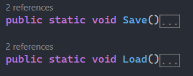
</p>

### PlayerPrefs like style of saving

This plugin also offers a way to save and load data just like the unity PlayerPrefs.
That can be achieved using these functions (They have the same name as the ones from the PlayerPrefs, and achieve pretty much the same functionality)

<p align="center">
  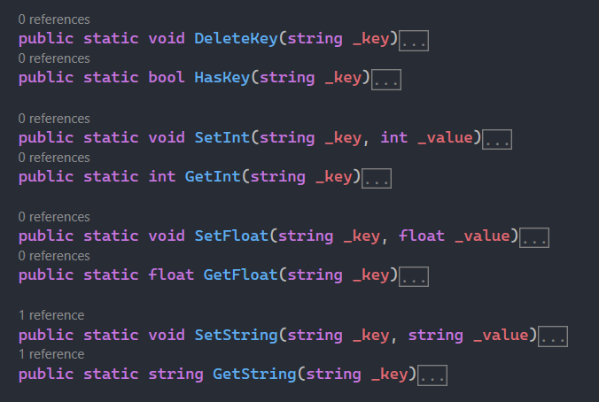
</p>

### Editor Utilities

This plugin also implements some editor utilities, you can use them by navigating to ``Tools`` in the top bar of the unity editor
As you can see there are two options:

<p align="center">
  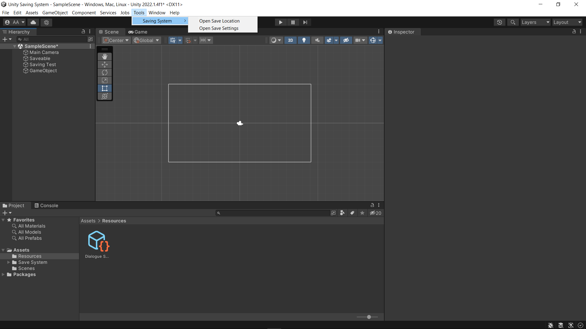
</p>

1. Open Save Location will open the location in which your save slots are stored, pressing it gives me this:

<p align="center">
  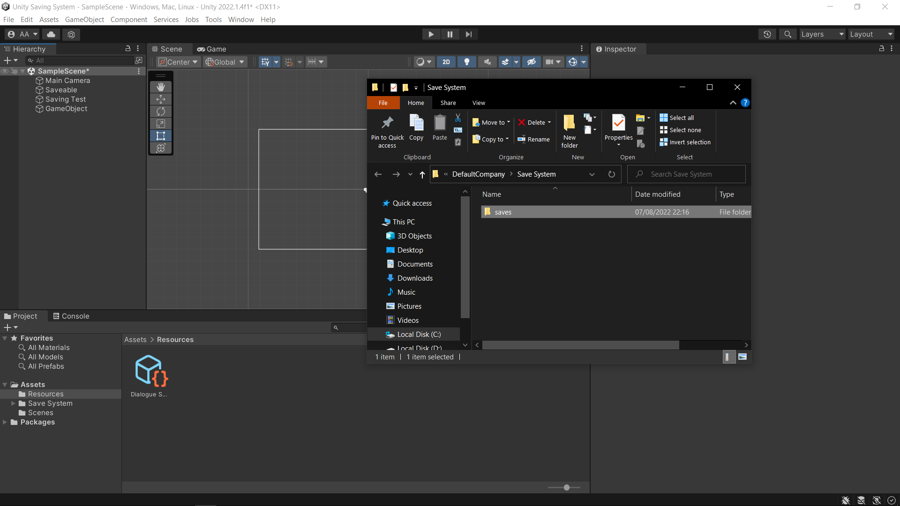
</p>

2. Open Save Settings will open the plugin's settings so you can configuer them.

<p align="center">
  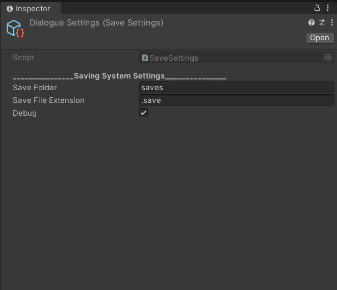
</p>
